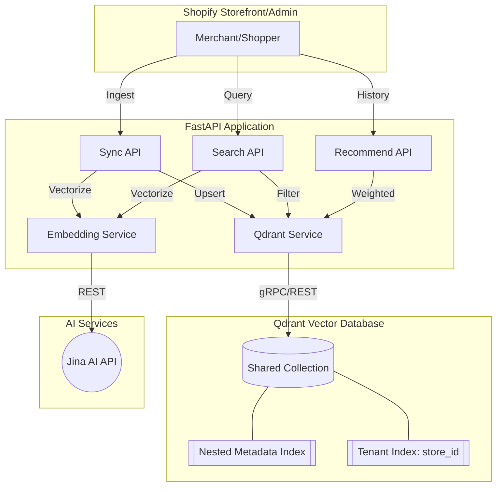
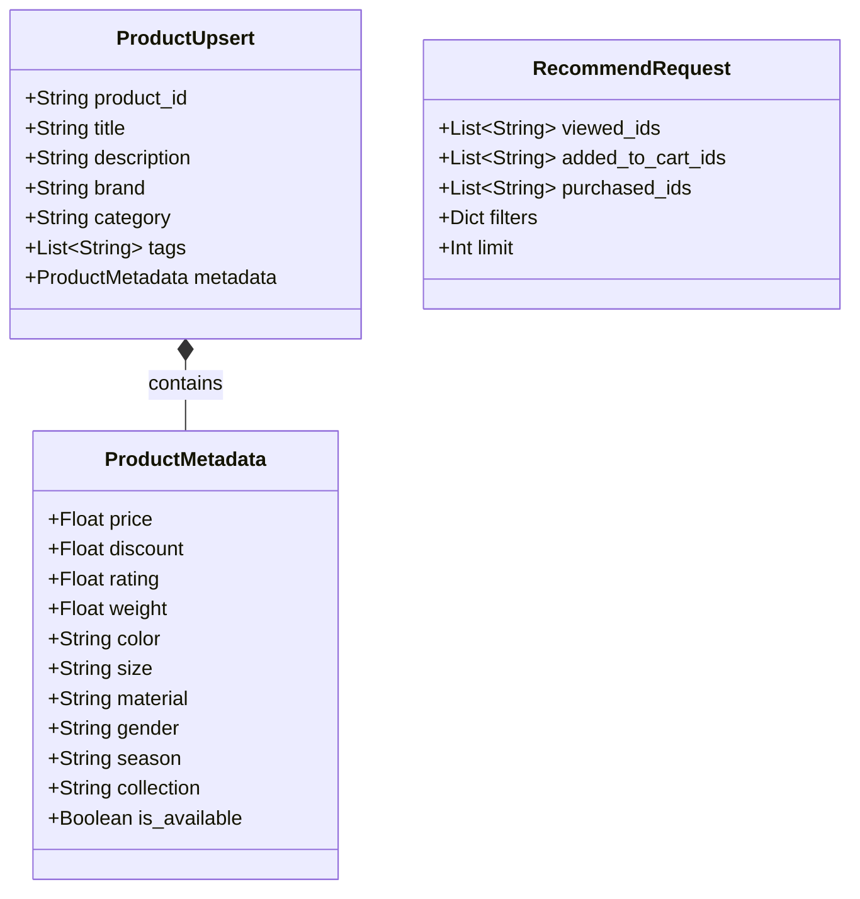
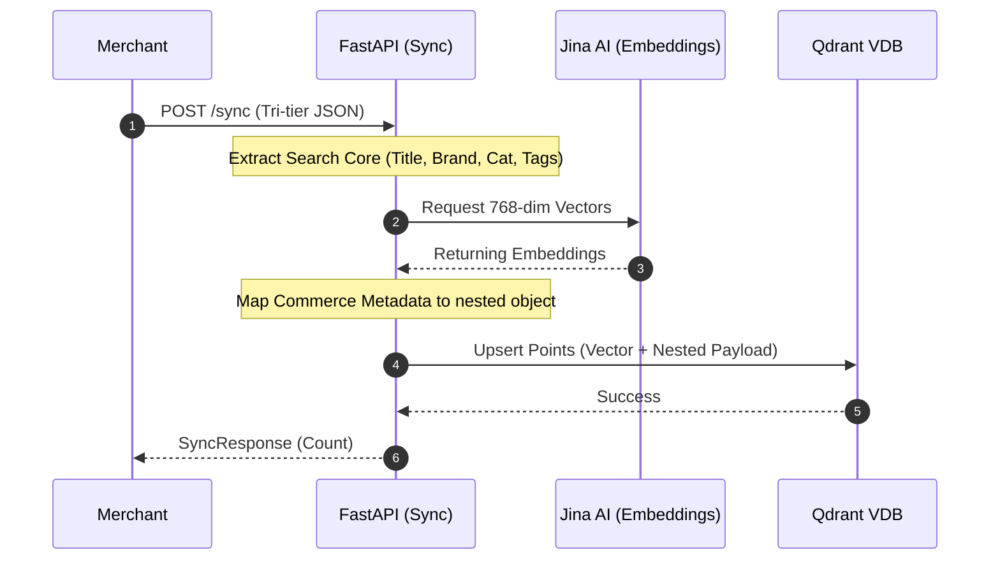
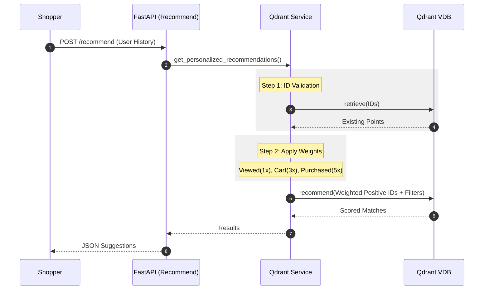
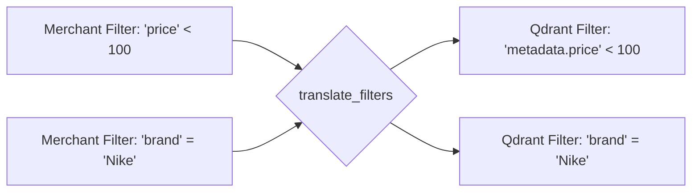

# Project Architecture & UML Diagrams

This document contains the visual representations of the **Unified Shopify Recommendation Engine** using [Mermaid.js](https://mermaid.js.org/).

---

### 1. Component Architecture
Shows the high-level interaction between the core system components and external AI services.

---

### 2. Data Model (Class Diagram)
Represents the **Tri-tier Structured Design** and the relationships between identity, search core, and metadata.

---

### 3. Standardized Ingestion Flow (Sequence Diagram)
Illustrates the process of syncing products with the specialized Search Core vs. Metadata split.

---

### 4. Personalized Recommendation Logic (Sequence Diagram)
Shows the weighted interaction logic and the validation against the index.

---

### 5. Multi-tenant Filtering Logic
Shows how the system automatically maps merchant filters to the nested metadata.

