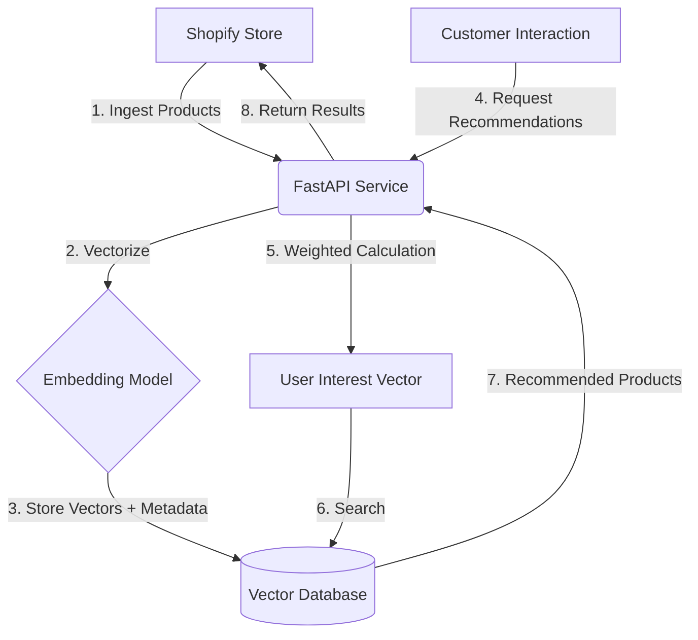
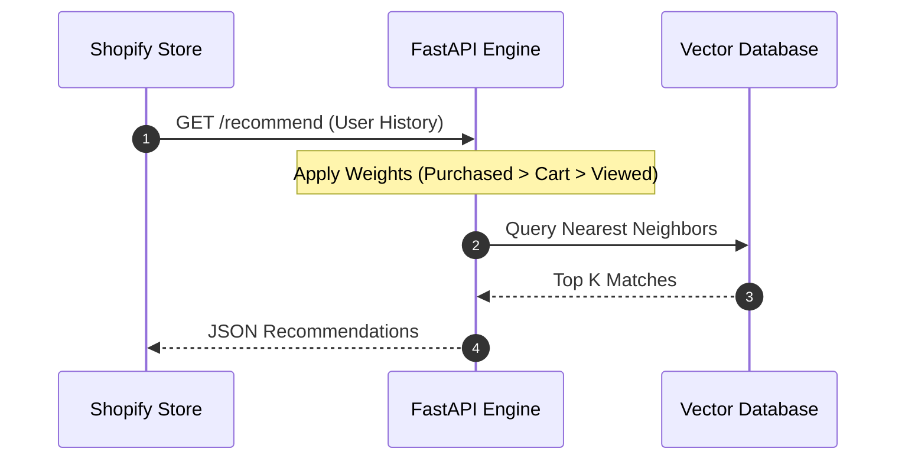

# Project Architecture & Logic Diagrams

This document contains the visual representations of the **Unified Shopify Recommendation Engine** using [Mermaid.js](https://mermaid.js.org/).

---

### 1. High-Level System Workflow (Flowchart)
This diagram shows the general flow of data from ingestion to recommendation.

---

### 2. Recommendation Sequence (Sequence Diagram)
This diagram illustrates the step-by-step logic of a recommendation request.

---

### 3. How to View and Edit These Diagrams
*   **VS Code:** Install the **"Markdown Preview Mermaid Support"** extension to see these diagrams live.
*   **GitHub/GitLab:** These diagrams are rendered automatically in the web interface.
*   **Mermaid Live Editor:** You can copy-paste the code blocks into [Mermaid.live](https://mermaid.live/) to export them as PNG/SVG.
