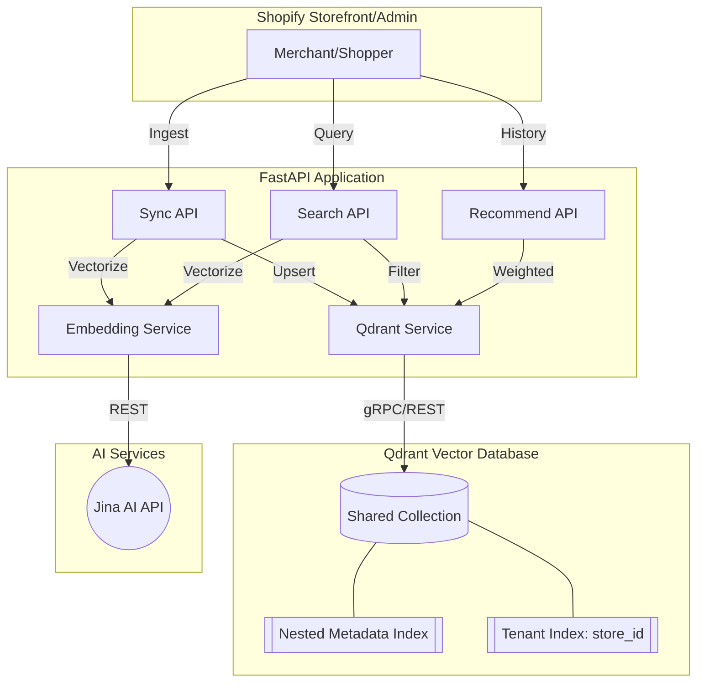
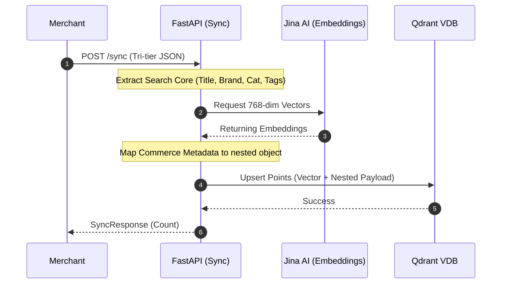
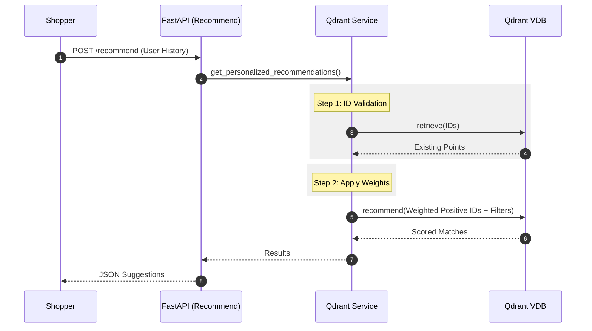

# Unified Shopify Recommendation Engine

An AI-driven product discovery and personalization platform for Shopify, powered by vector-based semantic search. This engine utilizes deep learning to understand product semantics and customer intent, delivering highly relevant results compared to traditional keyword-based systems.

---

## Core Capabilities

- **Semantic Search:** Enables product discovery based on conceptual meaning and natural language descriptions. [View API Specs](00_docs/api_endpoints.md#semantic-search)
- **Similarity Discovery:** Identifies conceptually related items based on a target product's high-dimensional vector representation. [View API Specs](00_docs/api_endpoints.md#similar-products)
- **Personalized Recommendations:** Generates unique product suggestions for every visitor by processing weighted interaction history. [View API Specs](00_docs/api_endpoints.md#personalized-recommendations)
- **Complementary Products:** Implements "Complete the Look" logic to find items from different categories.
- **Diversity Re-ranking:** Employs Maximal Marginal Relevance (MMR) to ensure a diverse selection of recommendations.
- **Tenant Isolation:** Enforces strict data separation via mandatory partition keys.

---

## Comprehensive Documentation

For detailed technical specifications and architectural deep dives, refer to the following:

- **[Project Overview](00_docs/project_overview.md):** High-level vision and core capabilities.
- **[System Architecture](00_docs/system_arch.md):** Deep dive into components, ingestion pipelines, and personalization logic.
- **[API Endpoint Specifications](00_docs/api_endpoints.md):** Detailed request/response schemas for all service endpoints.
- **[Architectural Diagrams](00_docs/diagrams.md):** Sequence and component diagrams illustrating system flows.
- **[Coding Standards](00_docs/coding_standards.md):** Guidelines for contributors and maintainers.

---

## System Architecture

The microservice architecture is built on FastAPI and optimized for real-time storefront personalization using Qdrant and Jina AI.



---

## Data Modeling: The Tri-tier Schema Standard

To maintain high performance and logical separation of concerns, the system employs a structured tri-tier data design:

1.  **Core Identity:** Mandatory identifiers including `store_id` (partition key) and `product_id`.
2.  **Search Core:** Textual fields (`title`, `description`, `brand`, `category`, and `tags`) vectorized into a 768-dimensional space via Jina AI.
3.  **Commerce Metadata:** A nested `metadata` object containing attributes used for real-time filtering (price, color, size, material, availability).

### Standardized Ingestion Pipeline


---

## Personalization Logic: Weighted User Intent

The system calculates a "User Interest Vector" by applying weights to customer interactions within the product vector space:
- **Purchased:** 5.0x Weight
- **Cart:** 3.0x Weight
- **Viewed:** 1.0x Weight



---

## Configuration

Environment variables should be configured in an `app/.env` file:

```env
# Qdrant Configuration
QDRANT_URL=http://localhost:6333
QDRANT_API_KEY=your_qdrant_key
COLLECTION_NAME=Shopify-recommendation-unified

# Jina AI Configuration
JINA_API_KEY=your_jina_key
JINA_EMBEDDING_URL=https://api.jina.ai/v1/embeddings
JINA_EMBEDDING_MODEL=jina-embeddings-v2-base-en

# Admin Configuration
ADMIN_API_KEY=your_admin_secret

# Recommendation Weights
WEIGHT_VIEW=1.0
WEIGHT_CART=3.0
WEIGHT_PURCHASE=5.0
```

---

## Installation and Setup

1.  **Clone Repository:**
    ```bash
    git clone https://github.com/your-repo/dd-shopify-recommendation-unified.git
    cd dd-shopify-recommendation-unified/app
    ```

2.  **Environment Setup:**
    ```bash
    python3 -m venv .venv
    source .venv/bin/activate
    pip install -r requirements.txt
    ```

3.  **Execute Service:**
    ```bash
    python3 main.py
    ```

4.  **API Documentation:**
    Interactive Swagger documentation is available at `/docs` relative to the host address. For full documentation of all sync and search endpoints, see the [API Endpoint Specifications](00_docs/api_endpoints.md).

---

## Security and Compliance

- **Multi-tenant Isolation:** Every request is strictly scoped by `store_id`. Payload filters are automatically prefixed and applied to the tenant partition.
- **Administrative Access:** Sensitive operations, including global metrics and store-level data deletion, require the `X-Admin-Token` header for authentication.
- **Rate Limiting:** Protects computational resources through tenant-based limits (300 requests/minute for storefront, 20 requests/minute for synchronization).
